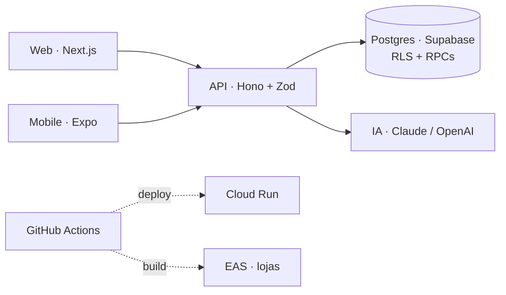

<a href="https://github.com/RodolfoAAPR">
  
</a>



```ts
const rodolfo = {
  cargo: ["AI Master", "Founder", "Tech Lead"],
  local: "Balneário Camboriú, SC / Maringá, PR",
  stack: {
    web: ["Next.js", "React", "TypeScript"],
    mobile: ["Expo", "React Native"],
    backend: ["Hono", "Node.js", "Java"],
    dados: ["PostgreSQL", "Supabase"],
    ia: ["Claude", "AI SDK", "Agentes"],
  },
  contato: "linkedin.com/in/rodolfoaapr",
} as const;
```



- Monorepo Turborepo + pnpm
- API type-safe com Hono + Zod
- Postgres com RLS e auditoria
- Web no Cloud Run + app iOS/Android com updates OTA
- E2E de web e mobile no CI
- IA: subagents em paralelo, revisão de código e entregas mais rápidas

<details>
<summary><b>Arquitetura</b></summary>
<br />



</details>

<br />

<picture>
  <source media="(prefers-color-scheme: dark)" srcset="https://skillicons.dev/icons?i=ts%2Creact%2Cnextjs%2Cnodejs%2Ctailwind%2Csupabase%2Cpostgres%2Cgcp%2Cgithubactions%2Cdocker%2Cjava&theme=dark" />
  
</picture>

<br /><br />

<picture>
  <source media="(prefers-color-scheme: dark)" srcset="https://raw.githubusercontent.com/RodolfoAAPR/RodolfoAAPR/output/github-snake-dark.svg" />
  
</picture>
