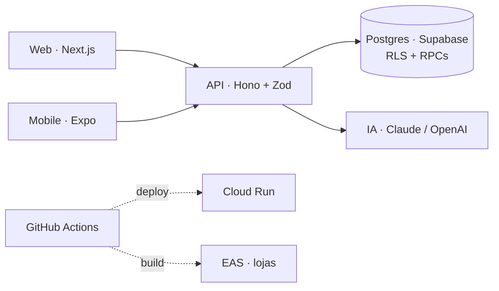

<a href="https://github.com/RodolfoAAPR">
  
</a>

```ts
const rodolfo = {
  cargo: ["AI Master", "Founder"],
  local: "Balneário Camboriú, SC / Maringá, PR",
  formacao: "Análise e Desenvolvimento de Sistemas",
  stack: {
    web: ["Next.js", "React", "TypeScript", "Tailwind"],
    mobile: ["Expo", "React Native"],
    backend: ["Hono", "Node.js", "Java"],
    dados: ["PostgreSQL", "Supabase", "Drizzle"],
    ia: ["Claude", "AI SDK", "agentes no ciclo de desenvolvimento"],
  },
  contato: "linkedin.com/in/rodolfoaapr",
} as const;
```

### Construindo agora

Marketplace imobiliário de lançamentos: web, app mobile e API num único monorepo, conectando incorporadoras, imobiliárias, corretores e compradores.

- **Monorepo** com Turborepo e pnpm: três apps e pacotes compartilhados de UI, billing, feature flags, i18n, e-mail e analytics.
- **API type-safe** em Hono com Zod, com um contrato único entre web e mobile.
- **Segurança no banco**: autorização por Row Level Security e regras de negócio críticas em funções transacionais do Postgres, com trilha de auditoria.
- **Compatibilidade com o app publicado**: o schema só evolui de forma aditiva, sem quebrar quem já está nas lojas.
- **Deploy sem chave**: GitHub Actions para Cloud Run com Workload Identity; mobile por EAS com atualização OTA.
- **Qualidade**: Vitest, E2E de web e mobile no CI, lint e formatação no hook de commit.
- **IA no fluxo**: agentes que transformam issue em pull request, sempre com revisão antes de entrar na main.

<details>
<summary><b>Arquitetura</b></summary>
<br />



</details>

<br />

<picture>
  <source media="(prefers-color-scheme: dark)" srcset="https://skillicons.dev/icons?i=ts,react,nextjs,nodejs,tailwind,supabase,postgres,gcp,githubactions,docker,java&theme=dark" />
  
</picture>

<br /><br />

<picture>
  <source media="(prefers-color-scheme: dark)" srcset="https://raw.githubusercontent.com/RodolfoAAPR/RodolfoAAPR/output/github-snake-dark.svg" />
  
</picture>
